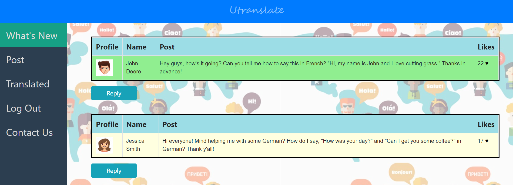

# Utranslate
My first website named Utranslate! Supports user logins, registrations  and the ability to makes posts. Check it out!

Website description: 

 Hi and welcome to Utranslate! Learning a language can often be confusing and difficult. There are times when you may need to know how to say a phrase in another language on the go. Although, common translators such as Google Translate may be able to give you quick answers, their responses are often at times inaccurate and not what you are looking for. These common translators are also unable to understand the contemporary language that is used such as slang. Try writing out some slang on a common translator and see for yourself. This is why Utranslate has been introduced!
 
Utranslate will allow you to have any phrase or word precisely translated in the language that you want. Furthermore, each user will also have the opportunity to help others out by translating their inquiries. This is all done through the Utranslate community. No more language barriers!

    A glimpse of the Utranslate website.
    
    
# Challenges Faced
A problem I came across was displaying the logout button for the time the user is logged in, and displaying the login button while the user has not logged in. This issue was solved with the use of sessions. Once the user logged in, their data was stored in a session. While the session still had their data, the button would display log out. When they logged out, the session was cleared and the button displays log in again.
